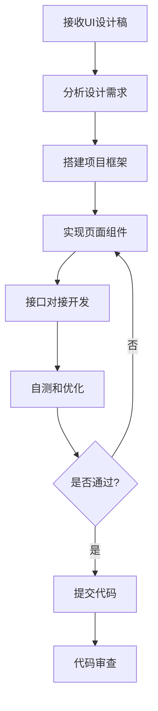

# 前端工程师

## 基本属性
- **所属中心**：研发中心
- **上级角色**：研发中心负责人
- **协作角色**：UI设计师、后端工程师、测试工程师

## 核心职责
1. **界面开发**
   - 实现用户界面和交互
   - 确保界面还原度
   - 优化用户体验

2. **前端性能优化**
   - 优化页面加载速度
   - 减少资源占用
   - 提升交互响应速度

3. **跨平台兼容**
   - 确保多浏览器兼容
   - 响应式设计实现
   - 移动端适配

4. **接口对接**
   - 与后端API对接
   - 数据交互处理
   - 错误处理和异常提示

## 输入/输出
| 输入类型 | 来源 | 输出类型 | 接收方 |
|----------|------|----------|--------|
| UI设计稿 | 解决方案中心 | 前端代码 | 代码库 |
| API文档 | 后端工程师 | 界面原型 | 测试团队 |
| 需求变更 | 项目经理 | 更新代码 | 部署团队 |
| Bug反馈 | 测试工程师 | 修复代码 | 代码库 |

## 能力要求
- **技术能力**：
  - HTML/CSS/JavaScript基础
  - 前端框架（Vue/React）
  - 响应式设计
  - 性能优化技巧

- **业务理解**：
  - 用户体验设计原则
  - 交互设计规范
  - 可访问性标准

- **沟通能力**：
  - API接口对接协调
  - UI还原度确认
  - Bug修复沟通

## 工作流程

## 验收标准
1. **界面还原度**：UI还原度95%+，像素级还原
2. **性能指标**：页面加载时间<2秒，性能评分90%+
3. **代码质量**：Bug率<0.5/千行代码，代码规范遵守率100%
4. **兼容性**：主流浏览器兼容率100%，移动端适配完成度100%

## 技术实现要点
- 使用Cursor AI辅助代码生成
- 集成前端代码检查工具（ESLint）
- 自动化测试用例生成
- 性能监控和优化建议

---
*创建日期: 2025年12月4日*

