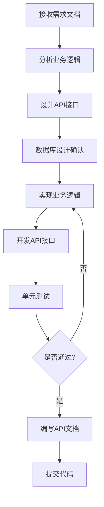

# 后端工程师

## 基本属性
- **所属中心**：研发中心
- **上级角色**：研发中心负责人
- **协作角色**：前端工程师、数据库工程师、测试工程师

## 核心职责
1. **业务逻辑实现**
   - 实现业务功能逻辑
   - 处理业务规则
   - 数据验证和处理

2. **API开发**
   - 设计和开发RESTful API
   - API文档编写
   - 接口测试和调试

3. **数据库交互**
   - 数据库操作实现
   - 查询优化
   - 事务处理

4. **性能优化**
   - 接口性能优化
   - 数据库查询优化
   - 缓存策略实现

## 输入/输出
| 输入类型 | 来源 | 输出类型 | 接收方 |
|----------|------|----------|--------|
| 需求文档 | 解决方案中心 | 后端代码 | 代码库 |
| 数据模型 | 数据库工程师 | API文档 | 前端团队 |
| 性能指标 | 测试工程师 | 优化方案 | 技术团队 |
| Bug反馈 | 测试工程师 | 修复代码 | 代码库 |

## 能力要求
- **技术能力**：
  - Python/Java等后端语言
  - Web框架（Flask/Django）
  - 数据库操作（SQL）
  - API设计和开发
  - 性能优化技巧

- **业务理解**：
  - 业务逻辑实现
  - 数据流处理
  - 系统集成

- **沟通能力**：
  - API接口规范协调
  - 技术方案讨论
  - Bug修复沟通

## 工作流程

## 验收标准
1. **API质量**：API可用率99%+，接口响应时间<500ms
2. **代码质量**：单元测试覆盖率90%+，Bug率<0.3/千行代码
3. **文档完整性**：API文档完整率100%，接口说明清晰
4. **性能指标**：数据库查询优化率80%+，接口性能达标率95%+

## 技术实现要点
- 使用Cursor AI辅助代码生成
- 集成单元测试框架（Pytest）
- 自动化API文档生成（Swagger）
- 性能监控和优化建议

---
*创建日期: 2025年12月4日*

