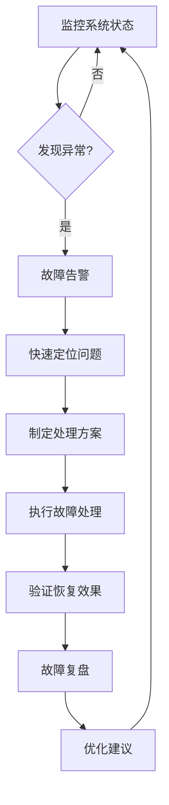

# 运维工程师

## 基本属性
- **所属中心**：交付运营中心
- **上级角色**：交付运营中心负责人
- **协作角色**：部署工程师、客户服务专员、研发中心

## 核心职责
1. **系统监控**
   - 监控系统运行状态
   - 收集和分析监控数据
   - 异常告警和处理

2. **故障处理**
   - 快速定位故障原因
   - 制定故障处理方案
   - 执行故障恢复操作

3. **性能优化**
   - 分析系统性能瓶颈
   - 提出优化建议
   - 实施性能优化方案

4. **安全维护**
   - 安全漏洞扫描和修复
   - 安全策略制定和执行
   - 安全事件响应

## 输入/输出
| 输入类型 | 来源 | 输出类型 | 接收方 |
|----------|------|----------|--------|
| 监控数据 | 系统监控工具 | 故障报告 | 技术团队 |
| 部署请求 | 部署工程师 | 运维方案 | 项目团队 |
| 用户反馈 | 客户服务专员 | 优化建议 | 研发中心 |
| 安全告警 | 安全系统 | 安全报告 | 事业部总监 |

## 能力要求
- **技术能力**：
  - Linux系统管理
  - 容器技术（Docker/K8s）
  - 监控工具使用（Prometheus/Grafana）
  - 日志分析能力
  - 自动化运维脚本

- **业务理解**：
  - 系统运行保障
  - SLA指标理解
  - 业务连续性要求

- **沟通能力**：
  - 故障通报和协调
  - 优化方案讲解
  - 安全事件报告

## 工作流程

## 验收标准
1. **系统可用性**：系统可用率99.9%+，SLA达标率100%
2. **故障响应**：故障响应时间<5分钟，故障恢复时间<30分钟
3. **安全维护**：安全漏洞修复率100%，安全事件响应时间<1小时
4. **性能优化**：性能优化建议采纳率80%+，系统性能提升>10%

## 技术实现要点
- 使用Python脚本自动化运维任务
- 集成监控告警系统（WebSocket实时推送）
- 使用Ollama分析日志和生成运维报告
- 建立运维知识库（RAGFlow）积累故障处理经验

---
*创建日期: 2025年12月4日*

