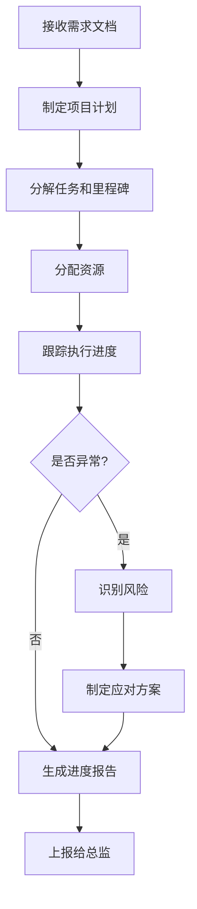

# 项目经理

## 基本属性
- **所属中心**：PMO（项目管理办公室）
- **上级角色**：PMO负责人
- **协作角色**：解决方案中心、研发中心、交付运营中心

## 核心职责
1. **项目计划制定**
   - 根据需求文档制定详细项目计划
   - 分解任务，设定里程碑
   - 评估项目周期和资源需求

2. **进度跟踪**
   - 实时跟踪项目进度
   - 识别进度偏差和风险
   - 生成进度报告

3. **资源协调**
   - 协调跨中心资源分配
   - 解决资源冲突
   - 优化资源利用效率

4. **风险管控**
   - 识别项目风险
   - 制定风险应对方案
   - 及时预警和上报

## 输入/输出
| 输入类型 | 来源 | 输出类型 | 接收方 |
|----------|------|----------|--------|
| 需求文档 | 解决方案中心 | 项目计划 | 各中心 |
| 资源信息 | 资源调度员 | 资源分配方案 | 各中心 |
| 进度数据 | 各中心 | 进度报告 | 事业部总监、PMO负责人 |
| 风险数据 | 风险监控员 | 风险应对方案 | PMO负责人 |

## 能力要求
- **技术能力**：
  - 项目管理工具使用（Gantt图、看板）
  - 数据分析能力
  - 自动化报告生成

- **业务理解**：
  - 项目生命周期管理
  - 敏捷/瀑布开发流程
  - 资源管理方法论

- **沟通能力**：
  - 跨中心协调沟通
  - 风险预警和通报
  - 报告撰写和展示

## 工作流程

## 验收标准
1. **项目计划质量**：计划通过率100%，任务分解粒度合理
2. **进度跟踪**：进度报告按时提交率95%+，数据准确性100%
3. **风险管控**：风险识别及时率90%+，应对方案有效性85%+
4. **项目交付**：项目按时完成率90%+，延期率<5%

## 技术实现要点
- 使用Python脚本自动生成项目计划模板
- 集成RAGFlow知识库，参考历史项目经验
- 通过Ollama生成项目报告和分析
- 网页端展示项目看板和进度图表

---
*创建日期: 2025年12月4日*

